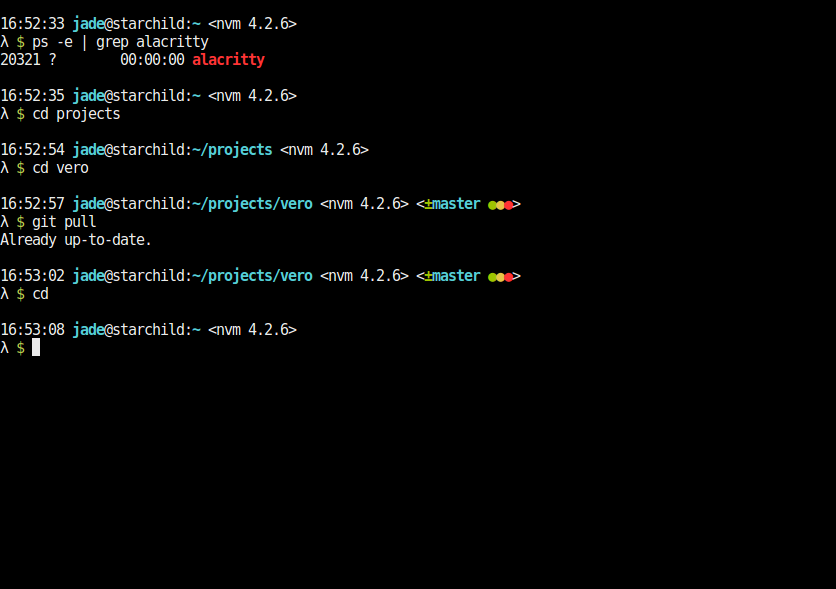

# Vero for Oh My ZSH!

Vero is an [Oh My ZSH shell](https://github.com/robbyrussell/oh-my-zsh) theme, created for simplicity, neatness and availability of information.

Features:

- Current Node.js version
- Git branch and status
- Timestamp
- SSH detection
- Current user
- Current working directory
- A fancy lambda symbol

## Preview



## Requirements

- ZSH
- A ZSH framework like [Oh My ZSH](https://github.com/robbyrussell/oh-my-zsh), [antigen](https://github.com/zsh-users/antigen), [zplug](https://github.com/zplug/zplug) or [zgen](https://github.com/tarjoilija/zgen)

## Installation

### Using Oh My ZSH!

1. Download and install the theme:

  ```bash
  wget https://github.com/Raindeer44/vero/archive/v0.9.3.tar.gz
  tar -xzvf v0.9.3.tar.gz
  cd vero-0.9.3
  make
  ```

2. Set vero as your ZSH theme. In your **~/.zshrc**:

  ```bash
  ZSH_THEME="vero"
  ```

### Using Antigen

  ```bash
  antigen bundle raindeer44/vero
  ```

### For Zgen users

If you're using [zgen](https://github.com/tarjoilija/zgen), add the following line to your **~/.zshrc** near your other ZSH plugins **after** the line `zgen oh-my-zsh`.

  ```bash
  zgen load raindeer44/vero vero master
  ```

### For Zplug users

If you're using [zplug](https://github.com/zplug/zplug), add the following line
to your **~/.zshrc** where you're adding your other zsh plugins **after** the
line `zplug "robbyrussell/oh-my-zsh"`.

  ```bash
  setopt prompt_subst
  zplug "raindeer44/vero", as:theme, use:vero.zsh-theme
  ```
